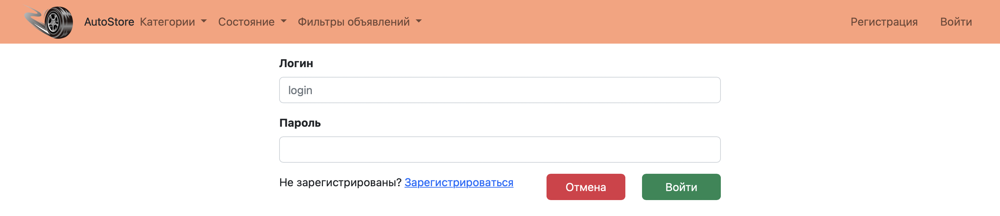
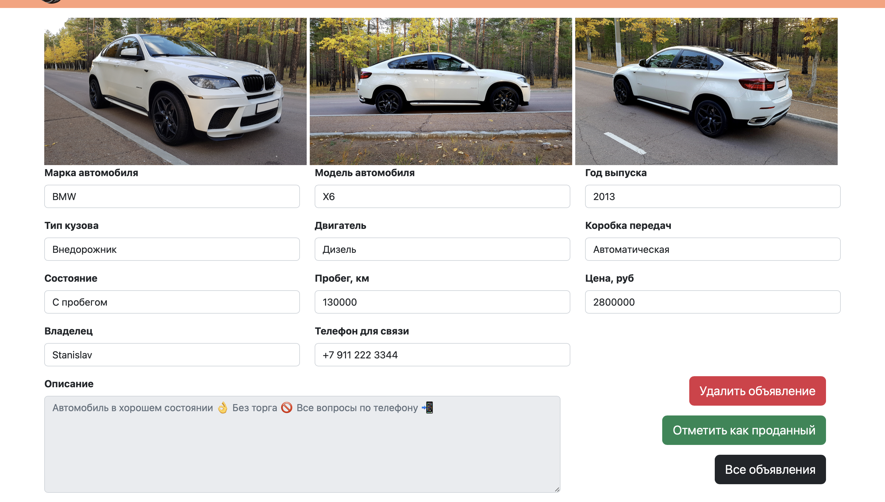

# AutoStore

## О проекте

Проект представляет собой упрощенный вариант сайта по продаже автомобилей.

Из логики реализовано:
+ Страница со списком всех объявлений с возможностью отсортировать категории авто, состоянию, и другим фильтрам(За последний день, С фото, Только актуальные).
+ Так же есть возможность поиска объявлений по названию автомобиля и кнопка "Добавить объявление".
+ При создании объявления можно выбрать тип кузова, тип двигателя, тип трансмиссии и другие характеристики.
+ Объявления можно переводить в состояние "Продано" или удалить из списка.

## Используемые технологии

+ Java 17
+ Spring boot 2.7.8
+ Lombok 1.18.22
+ Thymeleaf 3.0.15
+ Bootstrap 4.3.1
+ Hibernate 5.6.11.Final
+ Liquibase 4.15
+ PostgreSql 42.5.1

## Требования к окружению

+ Java 17
+ Maven 3.8
+ PostgreSql 14

## Запуск

+ Cкачать проект из этого репозитория
+ Создать базу данных car
+ Настроить соединение с базой данных
+ Запустить проект командой
``` 
mvn spring-boot:run -Pproduction
```
+ Перейти в браузере по [ссылке](http://localhost:8080/posts)

## Взаимодействие с приложением

#### Форма регистрации нового пользователя.


#### Форма авторизации. Только авторизованный пользователь может создать объявление, управлять им, удалять или менять статус.


#### Главная страница со списком объявлений. Можно найти объявление по марке машины. Есть кнопка добавить новое объявление.


#### Фильтр по категории в виде выпадающего списка.


#### Фильтр по состоянию в виде выпадающего списка.


#### Другие фильтры в виде выпадающего списка.


#### При нажатии на кнопку *Создать объявление* сначала пользователь выбирает категорию автомобиля. Нажимая на кнопку *Далее* попадает на страницу создания объявления.


#### Страница создания нового объявления.


#### При нажатии на название марки автомобиля на главной странице переходим на страницу с подробной информацией объявления. Кнопка *Удалить объявление* удаляет его из списка. Кнопка *Отметить как проданный* переводит бъявление в статус Продано.


#### Если пользователь не является создателем объявления, то у него нет возможности управлять объявлением.


### Контакты разработчика

:email:  rozovod.store@gmail.com